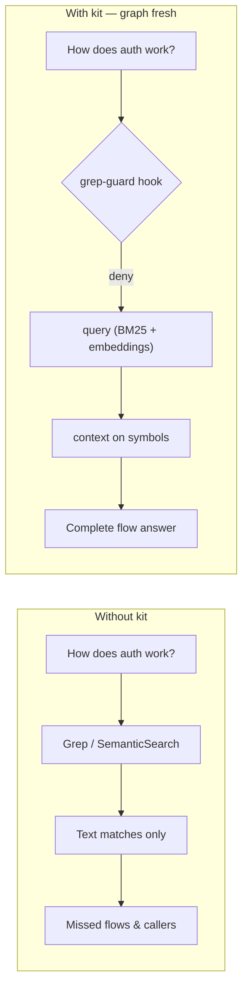
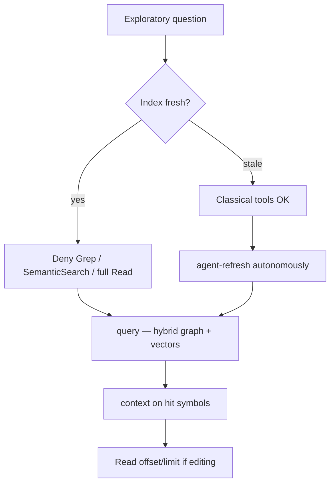
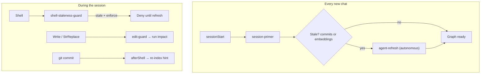
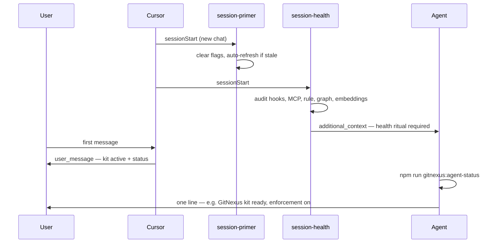
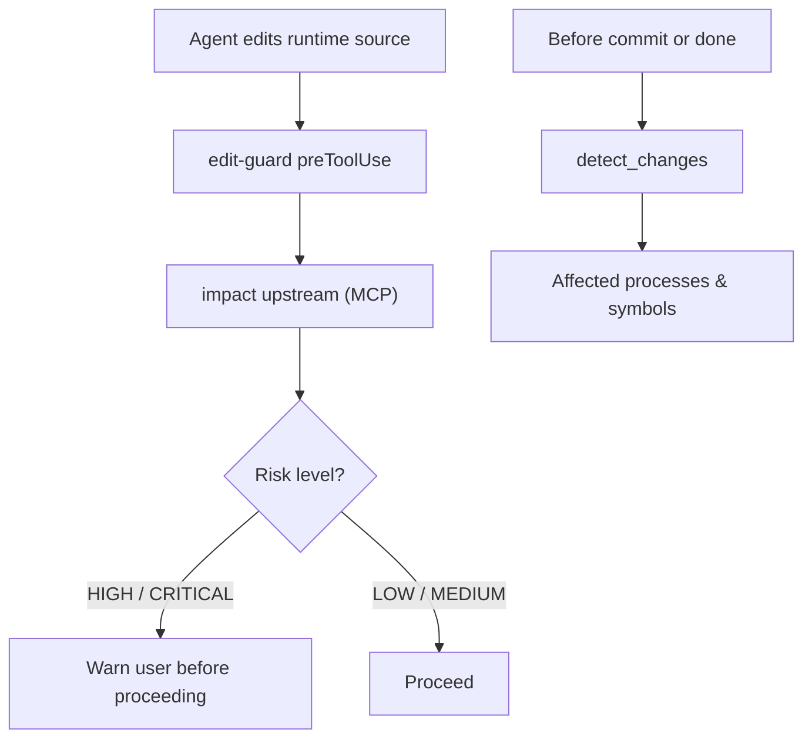
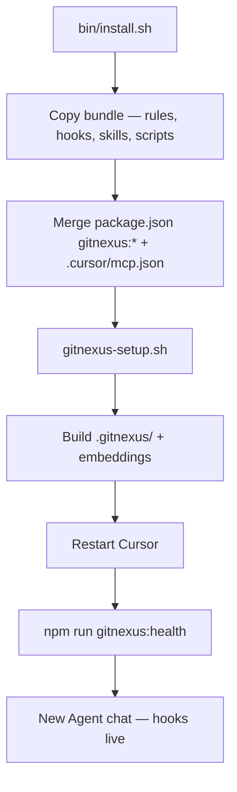

# cursor-gitnexus-kit

**GitNexus Cursor Experience** — official-style addon that makes Cursor agents use the knowledge graph **by default, every session, with enforcement**.

GitNexus builds the graph. This kit installs hooks, skills, and MCP wiring so agents prefer graph + embeddings over grep — and **blocks** lazy patterns when the index is fresh.

Extracted from production use in [crypto-trading-bot](https://github.com/ReidenXerx/crypto-trading-bot).

## What your team gets

| Outcome | How |
|--------|-----|
| Fewer missed callers | Symbol grep blocked → `context` / `impact` on the graph |
| Better “how does X work?” answers | SemanticSearch blocked → `query` (BM25 + embeddings) |
| Safer edits | Pre-edit reminders → `impact` upstream before shared code changes |
| Current graph | Agent runs `gitnexus:agent-refresh` when stale — no manual analyze |
| Enforced habit | Hooks **deny** grep-first tools when fresh — not a suggestion layer |

**Team guide (share this):** [`bundle/docs/GITNEXUS-CURSOR-GUIDE.md`](bundle/docs/GITNEXUS-CURSOR-GUIDE.md) → copied to `docs/GITNEXUS-CURSOR-GUIDE.md` on install.

## Why agents ignore GitNexus — and how this kit fixes it

GitNexus alone gives you a knowledge graph. Cursor agents still **default to grep, SemanticSearch, and full-file reads** — fast habits that miss callers, skip embeddings, and go stale silently. This kit is the **agent layer**: hooks enforce graph-first behavior, scripts keep the index fresh, and session rituals prove the stack is healthy.

### 1. Grep-first blind spots

**Problem:** Agents reach for `Grep` / `Glob` / `SemanticSearch` because those tools are familiar. Symbol grep finds text matches, not the graph — indirect callers, execution flows, and cross-repo links get missed.

**Our fix:** When the index is **fresh**, `preToolUse` hooks **deny** lazy search tools and inject copy-paste MCP calls (`context`, `query`). Users see a friendly *why* — enforcement stays hard.



### 2. Wrong tool for exploratory work

**Problem:** Even agents that *try* GitNexus often jump straight to `context` / `impact` / grep for fuzzy questions — skipping **embedding search**, which is what `query` is for.

**Our fix:** Enforcement rule + prompt router steer exploration to `query` first; SemanticSearch is blocked (same slot, better tool). Drill down with `context`, then `Read` offset/limit only when needed.



### 3. Stale graph — wrong answers or abandoned MCP

**Problem:** Index behind recent commits or missing embeddings → graph tools lie or fail. Agents either trust bad data or give up and grep forever.

**Our fix:** Embeddings required for “fresh”. Session primer auto-refreshes on new chat; shell/edit guards block work while stale (in enforce mode); post-commit hook nudges re-index.



### 4. Nobody knows if the kit is actually working

**Problem:** Hooks and MCP are invisible. Users think the agent is “broken” when grep is blocked; agents start tasks without verifying graph health.

**Our fix:** Session health hooks on every new chat — audit kit, tell the **agent** to confirm on first reply, show the **user** a one-time status line.



### 5. Edits without blast-radius checks

**Problem:** Agents patch shared code without asking what depends on it — refactors break callers the graph would have surfaced.

**Our fix:** `edit-guard` injects `impact` upstream before writes; enforcement rule treats HIGH/CRITICAL as stop-and-warn; `detect_changes` before commit / “am I done?”.



### 6. Scattered wiring — install once, enforce everywhere

**Problem:** Rules, hooks, MCP, skills, npm scripts, and index build are separate steps — teams skip pieces and enforcement never fires.

**Our fix:** One installer copies the bundle, merges scripts + MCP, builds the index, and documents the restart → health → new-chat ritual.



| Agent failure mode | Kit component |
|-------------------|---------------|
| Grep-first habits | `grep-guard`, `read-guard`, `00-gitnexus-enforcement.mdc` |
| Skips embeddings | Blocks SemanticSearch → `query`; rule gates |
| Stale / missing vectors | `check-staleness`, session-primer, shell/edit guards |
| “Is it working?” | `session-health` + `session-health-user`, `gitnexus:health` |
| Unsafe edits | `edit-guard`, `impact` / `detect_changes` in rule |
| Install friction | `install.sh` / `update.sh`, team guide, hook user messages |

## What it installs

| Component | Purpose |
|-----------|---------|
| `.cursor/rules/00-gitnexus-enforcement.mdc` | North-star agent contract (only always-on rule) |
| `.cursor/hooks.json` + hooks | Block lazy grep/read; staleness gate; session auto-refresh |
| Human-friendly hook messages | Users see *why* redirects happen — enforcement unchanged |
| Session health hooks | New chat audit + agent confirms kit on first reply |
| `.claude/skills/gitnexus*` | Playbooks for graph-first workflows |
| `scripts/gitnexus-*.sh` | Setup, sync, agent CLI, pack, git hooks |
| `.githooks/pre-commit` | Optional index refresh on commit |
| `.cursor/mcp.json` | Merges `gitnexus` MCP server |
| `package.json` scripts | `gitnexus:health`, `gitnexus:agent-refresh`, … |

Per-target repo (built locally): `.gitnexus/` index, `.cursor/skills/generated/` area skills.

## Prerequisites

- **Node.js** ≥ 22.9.0
- **git**
- **bash** (macOS/Linux; WSL on Windows)
- **Cursor** with **Hooks** and **MCP** enabled
- After `--quick` install: run `npm run gitnexus:agent-refresh` before graph tools work

## First install (checklist)

1. Clone this repo (or download a release).
2. Target repo must be a **git worktree** (`git init` if needed).
3. Run `./bin/install.sh /path/to/repo` (full) or `--quick` (hooks only).
4. **Restart Cursor** on the target project — MCP + hooks do not load until restart.
5. Run `npm run gitnexus:health` — share `docs/GITNEXUS-CURSOR-GUIDE.md` with your team.
6. Open a **new Agent chat** and describe your task.

**Note:** Install overwrites `.cursor/hooks.json` (backup at `.cursor/hooks.json.gn-kit.bak` if one existed). Kit skips global `~/.cursor/mcp.json` changes.

## Install into any repo

```bash
git clone https://github.com/ReidenXerx/cursor-gitnexus-kit.git
cd cursor-gitnexus-kit

# Full install + index build (can take a few minutes)
./bin/install.sh /path/to/your-repo

# Hooks/skills only — index later
./bin/install.sh /path/to/your-repo --quick

# Copy files only — skip gitnexus-setup
./bin/install.sh /path/to/your-repo --no-setup
```

Custom repo name (folder basename ≠ GitNexus registry name):

```bash
./bin/install.sh /path/to/your-repo --repo-name my-registered-repo-name
```

Then **restart Cursor** on the target project.

## What happens during install

```
install.sh
  → copy bundle (rules, hooks, skills, scripts, team guide)
  → merge package.json gitnexus:* scripts + .cursor/mcp.json
  → gitnexus-setup.sh (--skip-global-mcp)
      → sync .cursor/skills/
      → build .gitnexus/ index (unless --quick)
  → restart Cursor → npm run gitnexus:health → new Agent chat
```

## Update

```bash
./bin/update.sh /path/to/your-repo
```

Default: `--quick` (skips full re-index). Restart Cursor after updating.

## Uninstall

```bash
./bin/uninstall.sh /path/to/your-repo
./bin/uninstall.sh /path/to/your-repo --remove-index   # also remove .gitnexus/
```

## North star (agent contract)

> Prefer **graph + embeddings** (`query` for fuzzy work) when the index is fresh. Refresh autonomously when stale or embeddings are missing. Fall back to grep/read/search only when GitNexus is stale, failing, or wrong — say why.

## Target repo daily commands

```bash
npm run gitnexus:health           # human-friendly status (team leads)
npm run gitnexus:agent-brief      # session orientation (agents)
npm run gitnexus:agent-status     # staleness (agents)
npm run gitnexus:agent-refresh    # re-index when stale
npm run gitnexus:sync-teaching    # after pulling kit/rule updates
npm run gitnexus:setup -- --quick # hooks/skills only
```

## For maintainers

```bash
npm test                              # kit unit tests
./scripts/refresh-bundle-from-source.sh ../crypto-trading-bot
./bin/update.sh ../some-repo --quick
```

Technical bundle reference: [`docs/TEAM-BUNDLE.md`](docs/TEAM-BUNDLE.md)

## Pitch for GitNexus upstream

> GitNexus gives teams a code knowledge graph. **cursor-gitnexus-kit** is the Cursor agent layer: install once, enforce graph-first reasoning, autonomous refresh, human-readable status. Proposed integration: `gitnexus init --cursor-kit`.

## Bundle layout

```
bundle/
├── .cursor/rules hooks.json hooks/ gitnexus-hooks.json
├── .claude/skills/          # gitnexus*
├── docs/                    # GITNEXUS-CURSOR-GUIDE, TEAM-BUNDLE
├── scripts/
├── .githooks/
├── .vscode/
└── .gitnexusignore
```

Templates use `__GITNEXUS_REPO__` — substituted with the target repo name at install time.

## License

ISC
