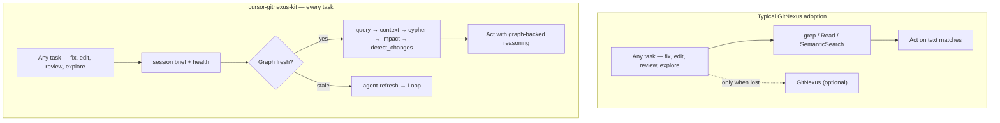
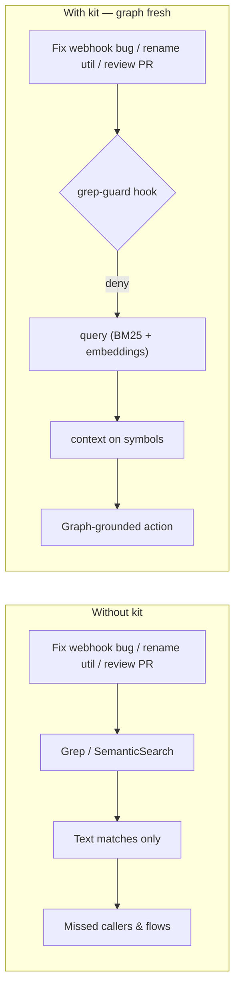
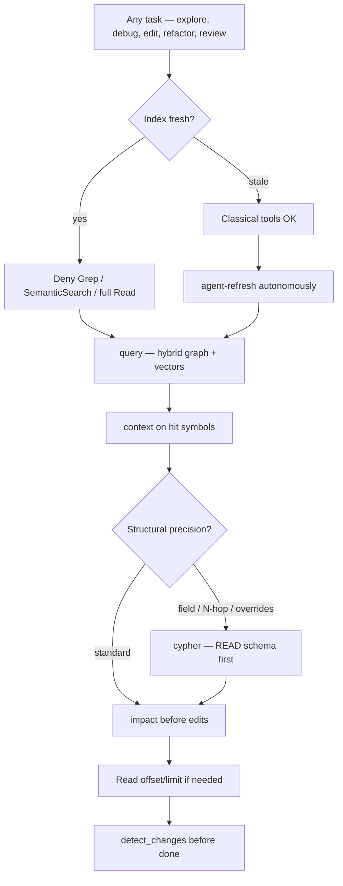
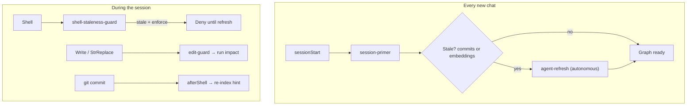
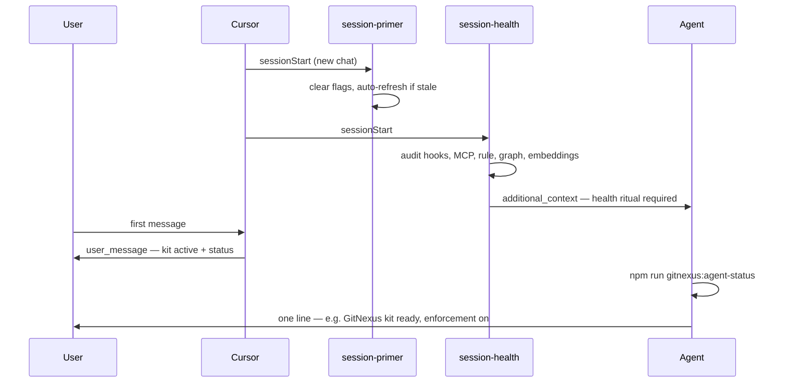
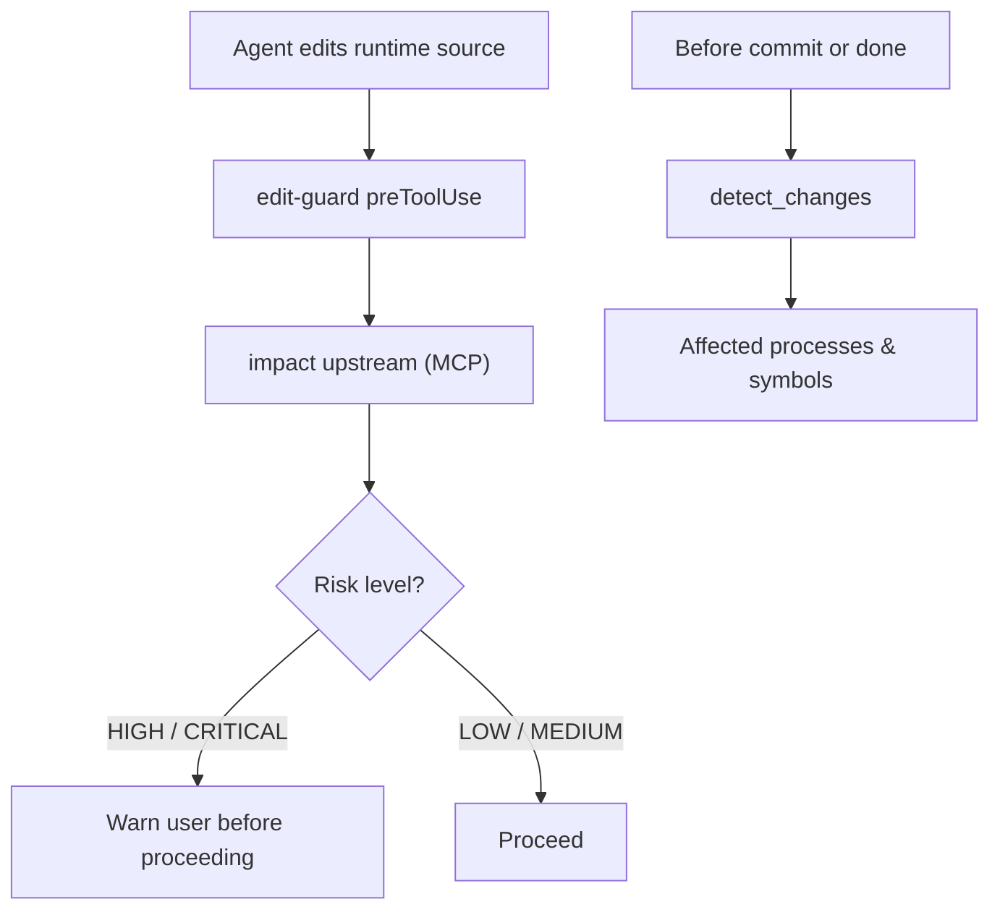
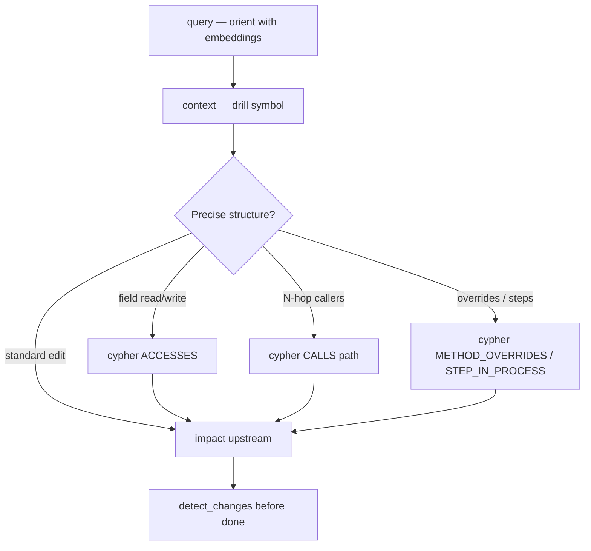
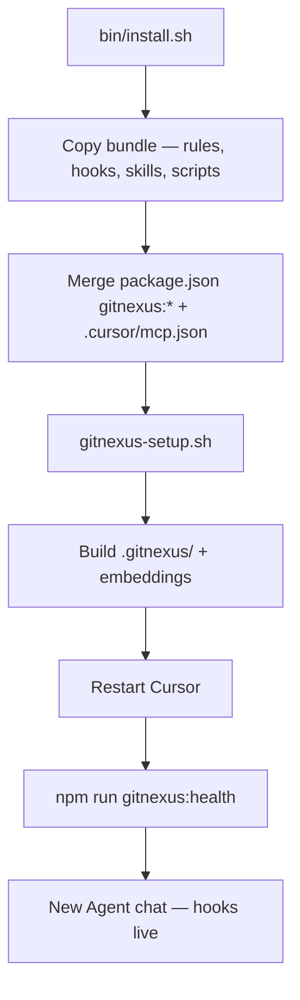

# cursor-gitnexus-kit

**GitNexus Cursor Experience** — official-style addon that makes Cursor agents use the knowledge graph **on every task, every session, with enforcement** — not only when surfacing unfamiliar code.

GitNexus builds the graph. This kit installs hooks, skills, and MCP wiring so **all agent reasoning** (explore, debug, edit, refactor, review, commit) runs through graph + embeddings first, **`cypher` for structural precision**, and **blocks** lazy grep/read habits when the index is fresh.

Extracted from production use in [crypto-trading-bot](https://github.com/ReidenXerx/crypto-trading-bot).

## What your team gets

| Outcome | How |
|--------|-----|
| Graph in **every** task loop | Hooks + gates on explore, edit, commit — not an optional “unfamiliar code” sidecar |
| Fewer missed callers | Symbol grep blocked → `context` / `impact` on the graph |
| Better reasoning on any question | SemanticSearch blocked → `query` (BM25 + embeddings) |
| Structural graph questions | Field data flow, N-hop chains, overrides → **`cypher`** (raw graph queries), not field grep |
| Safer edits (even one-liners) | Pre-edit reminders → `impact` upstream before shared code changes |
| Current graph | Agent runs `gitnexus:agent-refresh` when stale — no manual analyze |
| Enforced habit | Hooks **deny** grep-first tools when fresh — not a suggestion layer |

**Team guide (share this):** [`bundle/docs/GITNEXUS-CURSOR-GUIDE.md`](bundle/docs/GITNEXUS-CURSOR-GUIDE.md) → copied to `docs/GITNEXUS-CURSOR-GUIDE.md` on install.

## Cypher — raw graph queries (first-class, not optional)

GitNexus high-level tools (`query`, `context`, `impact`) cover most tasks. **`cypher`** is the escape hatch for **precise structural questions** on the indexed graph — the graph query language (think SQL for relationships, not ML/embeddings).

| Use Cypher when you need | Example edge |
|--------------------------|--------------|
| Who reads/writes a field/property? | `ACCESSES` + `reason: read/write` |
| Custom call-chain depth | `CALLS` variable-length path |
| Method override / inheritance | `METHOD_OVERRIDES`, `EXTENDS` |
| Ordered steps in a process | `STEP_IN_PROCESS` + `r.step` |

**Kit behavior:** field/property grep is **blocked** → hooks inject READ schema + `cypher` ACCESSES. Prompt-router detects structural intents. `agent-brief` prints copy-paste recipes. Agents still **`query` first** for fuzzy work — Cypher is gate #4, not a grep replacement for symbols (those go to `context`).

See [§7 below](#7-high-level-tools-miss-structural-graph-questions) for the full diagram.

## Why agents ignore GitNexus — and how this kit fixes it

GitNexus alone gives you a knowledge graph — but teams usually treat it as **onboarding Wikipedia**: agents reach for grep and file reads on every task, and only open GitNexus when they feel lost in unfamiliar code.

That misses the point. The graph should be the **default reasoning substrate** for *all* agent work: orient before answering, trace before debugging, impact before editing, diff-check before “done”. This kit is the **agent layer** that wires GitNexus into literally every task — hooks enforce it, scripts keep the index fresh, session rituals prove the stack is healthy.

### 0. Optional sidecar vs graph in every task

**Problem:** Without enforcement, GitNexus is a tool agents *may* use. They grep familiar files, patch from memory, and skip `impact` on “small” edits — the graph sits idle unless the prompt screams “explore this codebase.”

**Our fix:** A fixed **reasoning loop** on every session and every task type — session brief → orient (`query`) → drill (`context`) → structural precision (`cypher` when needed) → pre-edit (`impact`) → pre-done (`detect_changes`). Hooks block classical shortcuts when fresh so the graph participates in bugfixes, refactors, and reviews — not just architecture tours.



### 1. Grep-first blind spots (on familiar code too)

**Problem:** Agents reach for `Grep` / `Glob` / `SemanticSearch` on **every** task — even code they “already know” from context window. Text search misses indirect callers, execution flows, and cross-repo links; agents answer from partial matches.

**Our fix:** When the index is **fresh**, `preToolUse` hooks **deny** lazy search tools and inject copy-paste MCP calls (`context`, `query`) — for exploration *and* for grounding fixes, refactors, and reviews. Users see a friendly *why* — enforcement stays hard.



### 2. Wrong tool — graph skipped even when agents “try GitNexus”

**Problem:** Agents reserve GitNexus for big exploratory prompts. On everyday work they jump to `context` / `impact` / grep without `query`, or skip the graph entirely — **embedding search** never runs, and reasoning stays shallow.

**Our fix:** Enforcement rule + prompt router apply the same orient → drill → act loop to **all** reasoning. SemanticSearch is blocked (same slot, better tool). `query` first for fuzzy grounding; `context` to drill; `Read` offset/limit only when needed; `impact` before writes; `detect_changes` before commit.



### 3. Stale graph — wrong answers or abandoned MCP

**Problem:** Index behind recent commits or missing embeddings → graph tools lie or fail. Agents either trust bad data or give up and grep forever.

**Our fix:** Embeddings required for “fresh”. Session primer auto-refreshes on new chat; shell/edit guards block work while stale (in enforce mode); post-commit hook nudges re-index.



### 4. Nobody knows if the kit is actually working

**Problem:** Hooks and MCP are invisible. Users think the agent is “broken” when grep is blocked; agents start tasks without verifying graph health.

**Our fix:** Session health hooks on every new chat — audit kit, tell the **agent** to confirm on first reply, show the **user** a one-time status line.



### 5. Edits without blast-radius checks

**Problem:** Agents patch shared code without asking what depends on it — refactors break callers the graph would have surfaced.

**Our fix:** `edit-guard` injects `impact` upstream before writes; enforcement rule treats HIGH/CRITICAL as stop-and-warn; `detect_changes` before commit / “am I done?”.



### 7. High-level tools miss structural graph questions

**Problem:** `query`, `context`, and `impact` cover most tasks — but agents still **grep field names** or guess at N-hop call chains, override order, and process step sequences. Those need **raw graph traversals**, not text search.

**Our fix:** **`cypher`** is a first-class tier in the reasoning stack — copy-paste recipes in hooks + `agent-brief`, field grep routed to `ACCESSES`, prompt-router detects structural intents, enforcement rule gate #4.



| Structural question | Cypher edge |
|--------------------|-------------|
| Who reads/writes field X? | `ACCESSES` + `reason` |
| Custom call chain depth | `CALLS` variable-length |
| Override / inheritance | `METHOD_OVERRIDES`, `EXTENDS` |
| Process step order | `STEP_IN_PROCESS` + `r.step` |

### 6. Scattered wiring — install once, enforce everywhere

**Problem:** Rules, hooks, MCP, skills, npm scripts, and index build are separate steps — teams skip pieces and enforcement never fires.

**Our fix:** One installer copies the bundle, merges scripts + MCP, builds the index, and documents the restart → health → new-chat ritual.



| Agent failure mode | Kit component |
|-------------------|---------------|
| Graph only for “unfamiliar code” | Session gates + hooks on **every** task; `00-gitnexus-enforcement.mdc` reasoning loop |
| Grep-first habits | `grep-guard`, `read-guard`, `prompt-router` |
| Skips embeddings | Blocks SemanticSearch → `query`; rule gates |
| Stale / missing vectors | `check-staleness`, session-primer, shell/edit guards |
| “Is it working?” | `session-health` + `session-health-user`, `gitnexus:health` |
| Unsafe edits | `edit-guard`, `impact` / `detect_changes` in rule |
| Field/property grep | `cypher-helpers`, field grep → `ACCESSES` in `grep-guard` |
| Structural graph gaps | `cypher` tier in rule, `agent-brief`, prompt-router |
| Install friction | `install.sh` / `update.sh`, team guide, hook user messages |

## What it installs

| Component | Purpose |
|-----------|---------|
| `.cursor/rules/00-gitnexus-enforcement.mdc` | North-star agent contract (only always-on rule) |
| `.cursor/hooks.json` + hooks | Block lazy grep/read; staleness gate; session auto-refresh |
| Human-friendly hook messages | Users see *why* redirects happen — enforcement unchanged |
| Session health hooks | New chat audit + agent confirms kit on first reply |
| Cypher integration | `cypher-helpers.mjs` — recipes; field grep → ACCESSES in `grep-guard` |
| `.claude/skills/gitnexus*` | Playbooks for graph-first workflows |
| `scripts/gitnexus-*.sh` | Setup, sync, agent CLI, pack, git hooks |
| `.githooks/pre-commit` | Optional index refresh on commit |
| `.cursor/mcp.json` | Merges `gitnexus` MCP server |
| `package.json` scripts | `gitnexus:health`, `gitnexus:agent-refresh`, … |

Per-target repo (built locally): `.gitnexus/` index, `.cursor/skills/generated/` area skills.

## Prerequisites

- **Node.js** ≥ 22.9.0
- **git**
- **bash** (macOS/Linux; WSL on Windows)
- **Cursor** with **Hooks** and **MCP** enabled
- After `--quick` install: run `npm run gitnexus:agent-refresh` before graph tools work

## First install (checklist)

1. Clone this repo (or download a release).
2. Target repo must be a **git worktree** (`git init` if needed).
3. Run `./bin/install.sh /path/to/repo` (full) or `--quick` (hooks only).
4. **Restart Cursor** on the target project — MCP + hooks do not load until restart.
5. Run `npm run gitnexus:health` — share `docs/GITNEXUS-CURSOR-GUIDE.md` with your team.
6. Open a **new Agent chat** and describe your task.

**Note:** Install overwrites `.cursor/hooks.json` (backup at `.cursor/hooks.json.gn-kit.bak` if one existed). Kit skips global `~/.cursor/mcp.json` changes.

## Install into any repo

```bash
git clone https://github.com/ReidenXerx/cursor-gitnexus-kit.git
cd cursor-gitnexus-kit

# Full install + index build (can take a few minutes)
./bin/install.sh /path/to/your-repo

# Hooks/skills only — index later
./bin/install.sh /path/to/your-repo --quick

# Copy files only — skip gitnexus-setup
./bin/install.sh /path/to/your-repo --no-setup
```

Custom repo name (folder basename ≠ GitNexus registry name):

```bash
./bin/install.sh /path/to/your-repo --repo-name my-registered-repo-name
```

Then **restart Cursor** on the target project.

## What happens during install

```
install.sh
  → copy bundle (rules, hooks, skills, scripts, team guide)
  → merge package.json gitnexus:* scripts + .cursor/mcp.json
  → gitnexus-setup.sh (--skip-global-mcp)
      → sync .cursor/skills/
      → build .gitnexus/ index (unless --quick)
  → restart Cursor → npm run gitnexus:health → new Agent chat
```

## Update

```bash
./bin/update.sh /path/to/your-repo
```

Default: `--quick` (skips full re-index). Restart Cursor after updating.

## Uninstall

```bash
./bin/uninstall.sh /path/to/your-repo
./bin/uninstall.sh /path/to/your-repo --remove-index   # also remove .gitnexus/
```

## Advanced enforcement (beyond query/context)

| Capability | What it does | Commands / hooks |
|------------|--------------|------------------|
| **Cypher** | Raw graph queries — field ACCESSES, N-hop CALLS, overrides | `grep-guard` (fields), `read-guard` (data-flow), `agent-brief` recipes |
| **`rename` MCP** | Graph-coordinated multi-file symbol rename (not find-and-replace) | `edit-guard` blocks blind StrReplace; prompt-router on "rename X to Y" |
| **API router profile** | Auto-detect Express (`api_impact`) vs custom router (`gitnexus-api-routes`) | `npm run gitnexus:detect-api` at install → `.cursor/gitnexus-api-profile.json` |
| **Graph smoke test** | Cypher sanity check (ACCESSES edges, Route nodes) after index build | `npm run gitnexus:graph-smoke`; runs in pre-commit after refresh |

### What is `rename` MCP? (not ciphertext, not grep)

When you ask to **rename a function/class across the repo**, agents default to **StrReplace** or find-and-replace — missing graph-backed references and test files. GitNexus **`rename`** walks the graph + text search, tags edits by confidence, and supports **`dry_run: true`** preview. The kit **nudges** agents: prompt says "rename X to Y" → playbook `impact` → `rename` dry_run; `edit-guard` catches StrReplace that only swaps one identifier.

## Target repo daily commands

```bash
npm run gitnexus:health           # human-friendly status (team leads)
npm run gitnexus:agent-brief      # session orientation (agents)
npm run gitnexus:agent-status     # staleness (agents)
npm run gitnexus:agent-refresh    # re-index when stale
npm run gitnexus:graph-smoke      # Cypher / ACCESSES sanity check (CI)
npm run gitnexus:detect-api       # refresh HTTP router profile (Express vs custom)
npm run gitnexus:sync-teaching    # after pulling kit/rule updates
npm run gitnexus:setup -- --quick # hooks/skills only
```

## North star (agent contract)

> GitNexus is the **default reasoning layer for every task** — not a fallback when code is unfamiliar. Prefer **graph + embeddings + cypher** (`query` to orient, `cypher` for structural precision, `rename` for symbol renames) when the index is fresh. Refresh autonomously when stale or embeddings are missing. Fall back to grep/read/search only when GitNexus is stale, failing, or wrong — say why.

## For maintainers

```bash
npm test                              # kit unit tests
./scripts/refresh-bundle-from-source.sh ../crypto-trading-bot
./bin/update.sh ../some-repo --quick
```

Technical bundle reference: [`docs/TEAM-BUNDLE.md`](docs/TEAM-BUNDLE.md)

## Pitch for GitNexus upstream

> GitNexus gives teams a code knowledge graph. **cursor-gitnexus-kit** is the Cursor agent layer: install once, wire the graph into **every task** (not just codebase tours), enforce graph-first reasoning, autonomous refresh, human-readable status. Proposed integration: `gitnexus init --cursor-kit`.

## Bundle layout

```
bundle/
├── .cursor/rules hooks.json hooks/ gitnexus-hooks.json
│   └── hooks/lib/cypher-helpers.mjs   # Cypher copy-paste recipes
├── .claude/skills/          # gitnexus*
├── docs/                    # GITNEXUS-CURSOR-GUIDE, TEAM-BUNDLE
├── scripts/
├── .githooks/
├── .vscode/
└── .gitnexusignore
```

Templates use `__GITNEXUS_REPO__` — substituted with the target repo name at install time.

## License

ISC
