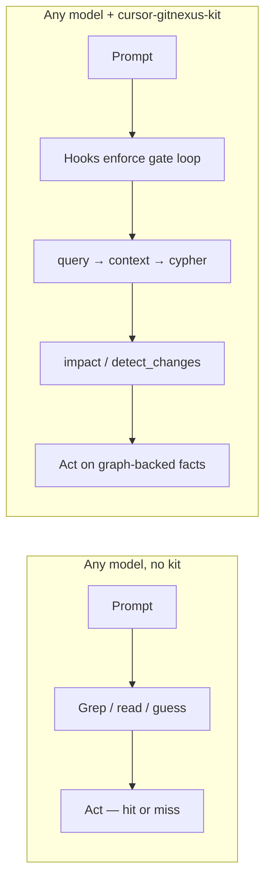
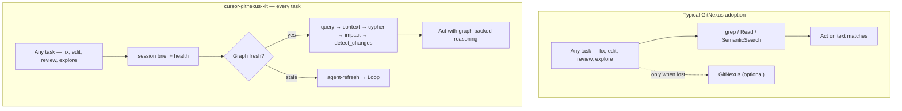
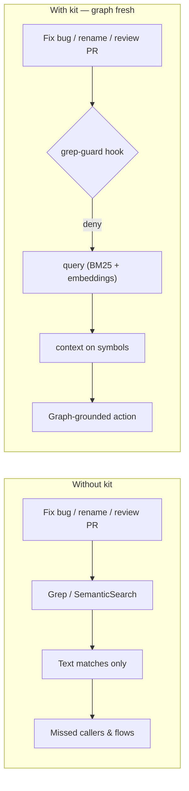
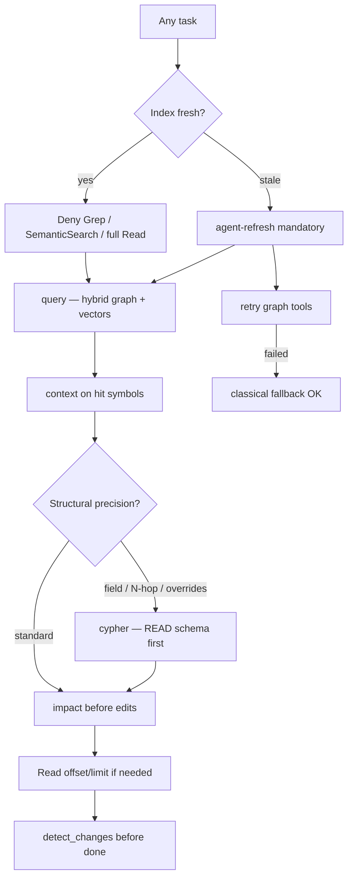
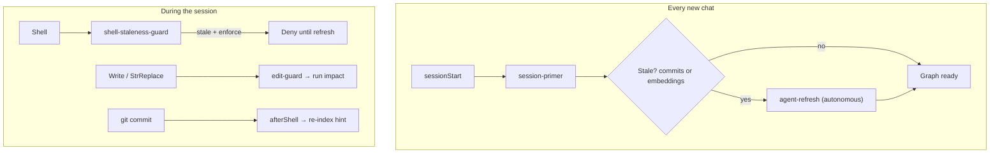
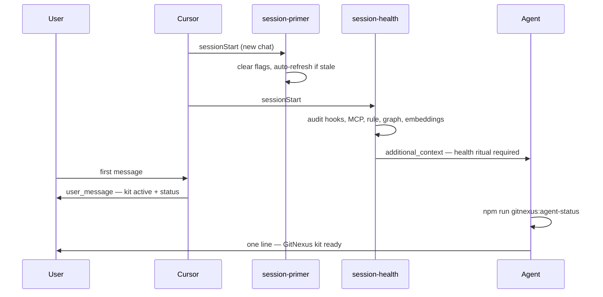
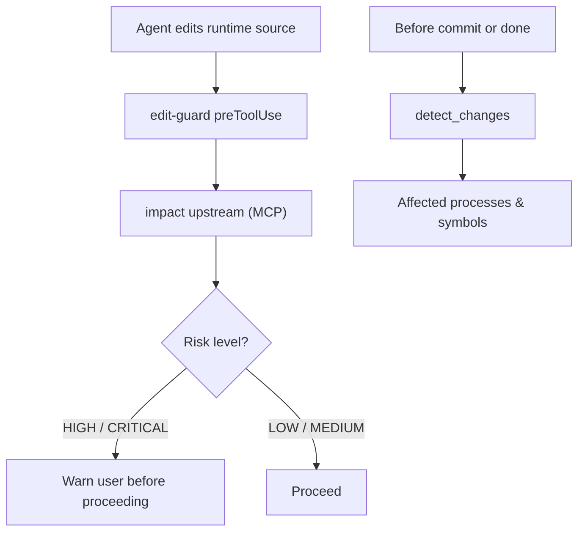
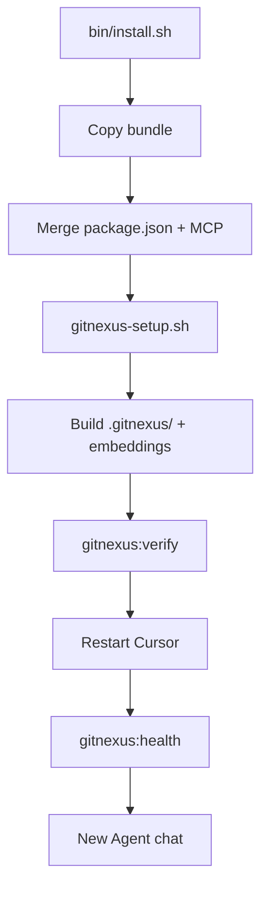
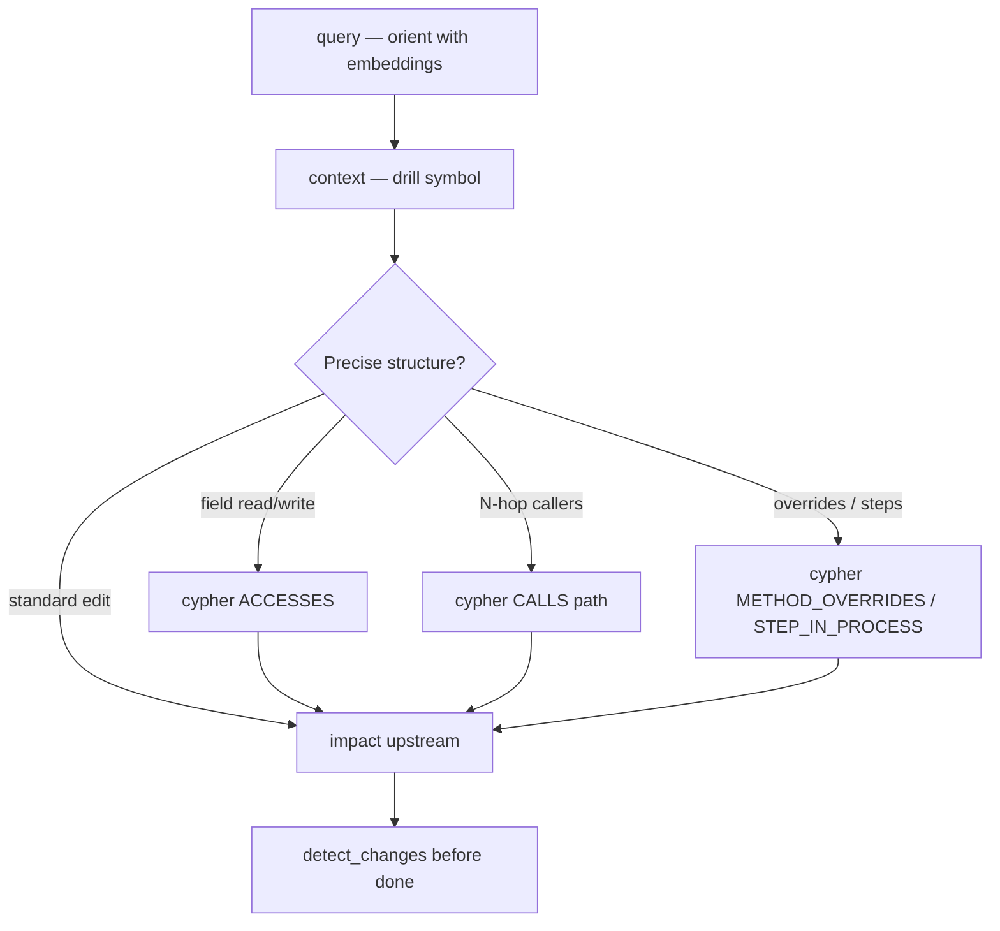

# Architecture — why agents ignore GitNexus (and how this kit fixes it)

GitNexus builds the knowledge graph. **cursor-gitnexus-kit** is the Cursor agent layer: hooks, skills, MCP wiring, and install UX so the graph participates in **every task** — not only when code feels unfamiliar.

Production-hardened in [crypto-trading-bot](https://github.com/ReidenXerx/crypto-trading-bot). Proposed upstream integration: `gitnexus init --cursor-kit`.

---

## Model tiers — who gains what

**Core product thesis:** better agent job results by **offloading repo reasoning to the graph** and **forcing a proven tool loop** via hooks — for **every model tier**, with the **largest relative lift on low-cost and local models**.

Expensive models still grep-first, skip `impact`, and burn tokens on full-file reads. They *can* recover with more retries — budget models usually can't. **The kit fixes the workflow for both:**



| Who | Primary gain |
|-----|----------------|
| **Budget / fast / local** | Viable for serious repo work — graph holds structure the model lacks |
| **Flagship / expensive** | Same enforced loop — **fewer tokens**, fewer sloppy edits, model effort goes to reasoning not spelunking |

| Capability models often “simulate” | What the kit provides instead |
|-------------------------------------|-------------------------------|
| Remembering callers across the repo | `context` + `impact` on the graph |
| Fuzzy “where is X implemented?” | `query` (BM25 + embeddings) |
| Field / N-hop structural questions | `cypher` (ACCESSES, CALLS, overrides) |
| Safe refactors | `rename` dry_run + pre-edit `impact` |
| Knowing when to stop exploring | Fixed gates; hooks block tool spam |

**Positioning for GitNexus authors / buyers:** not “replace your flagship model” — **(a)** downgrade tier without losing repo quality, **(b)** keep flagship and waste less, **(c)** local/zero-API paths with the same gates. Index + embeddings amortize across all tiers.

The enforcement rule explicitly supports **local LLM / zero API cost** paths: rebuild graph context freely; do not skip gates for speed.

---

## 0. Optional sidecar vs graph in every task

**Problem:** Without enforcement, GitNexus is a tool agents *may* use. They grep familiar files, patch from memory, and skip `impact` on “small” edits — the graph sits idle unless the prompt screams “explore this codebase.”

**Our fix:** A fixed **reasoning loop** on every session and every task type — session brief → orient (`query`) → drill (`context`) → structural precision (`cypher` when needed) → pre-edit (`impact`) → pre-done (`detect_changes`). Hooks block classical shortcuts when fresh so the graph participates in bugfixes, refactors, and reviews — not just architecture tours.



## 1. Grep-first blind spots (on familiar code too)

**Problem:** Agents reach for `Grep` / `Glob` / `SemanticSearch` on **every** task — even code they “already know” from context window. Text search misses indirect callers, execution flows, and cross-repo links.

**Our fix:** When the index is **fresh**, `preToolUse` hooks **deny** lazy search tools and inject copy-paste MCP calls (`context`, `query`).



## 2. Wrong tool — graph skipped even when agents “try GitNexus”

**Problem:** Agents reserve GitNexus for big exploratory prompts. On everyday work they jump to `context` / `impact` / grep without `query`.

**Our fix:** Enforcement rule + prompt router apply the same orient → drill → act loop to **all** reasoning.



## 3. Stale graph — wrong answers or abandoned MCP

**Problem:** Index behind recent commits or missing embeddings → graph tools lie or fail.

**Our fix:** Embeddings required for “fresh”. Session primer auto-refreshes on new chat; shell/edit guards block work while stale.



## 4. Nobody knows if the kit is actually working

**Problem:** Hooks and MCP are invisible. Users think the agent is “broken” when grep is blocked.

**Our fix:** Session health hooks on every new chat — audit kit, tell the **agent** to confirm on first reply, show the **user** a one-time status line.



## 5. Edits without blast-radius checks

**Problem:** Agents patch shared code without asking what depends on it.

**Our fix:** `edit-guard` injects `impact` upstream before writes; `detect_changes` before commit / “am I done?”.



## 6. Scattered wiring — install once, enforce everywhere

**Problem:** Rules, hooks, MCP, skills, npm scripts, and index build are separate steps — teams skip pieces.

**Our fix:** One installer copies the bundle, merges gated scripts + MCP, builds the index, runs verification.



## 7. High-level tools miss structural graph questions

**Problem:** Agents grep field names or guess at N-hop call chains — those need **raw graph traversals**.

**Our fix:** **`cypher`** is a first-class tier — field grep routed to `ACCESSES`, prompt-router detects structural intents.



| Structural question | Cypher edge |
|--------------------|-------------|
| Who reads/writes field X? | `ACCESSES` + `reason` |
| Custom call chain depth | `CALLS` variable-length |
| Override / inheritance | `METHOD_OVERRIDES`, `EXTENDS` |
| Process step order | `STEP_IN_PROCESS` + `r.step` |

---

## Component map

| Agent failure mode | Kit component |
|-------------------|---------------|
| Budget model can't "hold the repo in head" | Enforced `query` → `context` → `cypher` loop |
| Graph only for “unfamiliar code” | Session gates + `00-gitnexus-enforcement.mdc` |
| Grep-first habits | `grep-guard`, `read-guard`, `prompt-router` |
| Skips embeddings | Blocks SemanticSearch → `query` |
| Stale / missing vectors | `check-staleness`, session-primer, shell/edit guards |
| “Is it working?” | `session-health`, `gitnexus:health`, `gitnexus:verify` |
| Unsafe edits | `edit-guard`, `impact`, `detect_changes` |
| Field/property grep | `cypher-helpers`, ACCESSES in `grep-guard` |
| Blind symbol renames | `rename` MCP + `edit-guard` |
| Install friction | `install.sh`, gated npm scripts, team guide |

## Cypher — raw graph queries

GitNexus high-level tools (`query`, `context`, `impact`) cover most tasks. **`cypher`** is for **precise structural questions** on the indexed graph.

| Use Cypher when you need | Example edge |
|--------------------------|--------------|
| Who reads/writes a field/property? | `ACCESSES` + `reason: read/write` |
| Custom call-chain depth | `CALLS` variable-length path |
| Method override / inheritance | `METHOD_OVERRIDES`, `EXTENDS` |
| Ordered steps in a process | `STEP_IN_PROCESS` + `r.step` |

Agents still **`query` first** for fuzzy work — Cypher is gate #4, not a grep replacement for symbols (those go to `context`).

## What gets installed

| Component | Purpose |
|-----------|---------|
| `.cursor/rules/00-gitnexus-enforcement.mdc` | North-star agent contract (only always-on rule) |
| `.cursor/hooks.json` + hooks | Block lazy grep/read; staleness gate; session auto-refresh |
| Session health hooks | New chat audit + agent confirms kit on first reply |
| Cypher integration | `cypher-helpers.mjs`; field grep → ACCESSES |
| `.claude/skills/gitnexus*` | Playbooks for graph-first workflows |
| `scripts/gitnexus-*` | Setup, sync, agent CLI, pack, git hooks |
| `.githooks/pre-commit` | Optional index refresh on commit |
| `.cursor/mcp.json` | Merges `gitnexus` MCP server |
| Gated `package.json` scripts | `gitnexus:health`, `gitnexus:verify`, gate docs |

Per-target repo (built locally): `.gitnexus/` index, `.cursor/skills/generated/` area skills.

## Bundle layout

```
bundle/
├── .cursor/rules/ hooks.json hooks/
│   └── hooks/lib/          # cypher, rename, verify, graph-smoke, …
├── .claude/skills/         # gitnexus*
├── docs/                   # GITNEXUS-CURSOR-GUIDE, TEAM-BUNDLE
├── scripts/
├── .githooks/
└── .gitnexusignore
```

Templates use `__GITNEXUS_REPO__` — substituted with the target repo name at install time.
